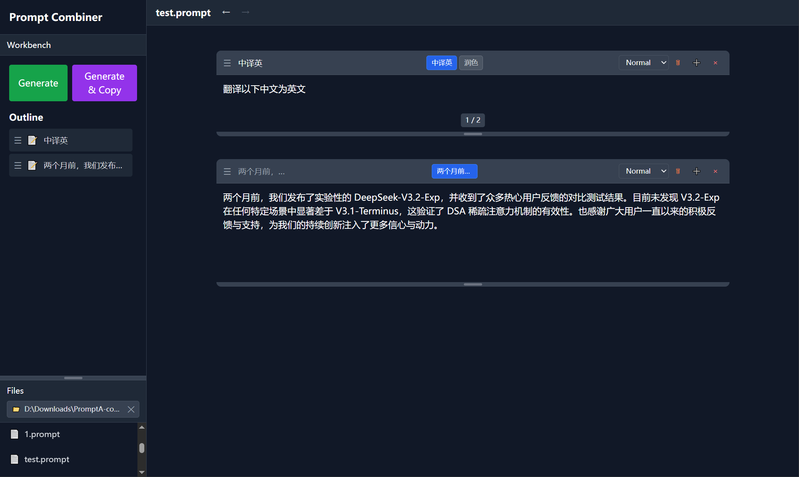

# Prompt Combiner



## 中文文档

### 🎯 简介

Prompt Combiner 是一款跨平台的提示词管理和组合工具，帮助你高效地组织、管理和生成 AI 提示词。

### ✨ 主要功能

- **多文本框管理**：创建多个文本框，支持拖拽排序
- **文件框（File Box）**：管理和引用多个文件，自动生成带文件路径的代码块
  - 支持批量添加文件
  - 可设置路径显示分段数
  - 文件内容自动读取并生成代码块格式
- **三种模式**：
  - **普通模式**：参与最终提示词生成
  - **禁用模式**：不参与生成
  - **影子模式**：不参与生成，但可作为变量使用（如 `{{变量名}}`）
- **变体支持**：为每个文本框创建多个版本，方便切换
- **自动保存**：编辑内容自动保存到本地
- **撤销/重做**：支持 Ctrl+Z 撤销、Ctrl+Y 重做
- **工作区管理**：选择工作目录，管理 `.prompt` 文件

### 📥 下载安装

我们提供预编译的安装包，支持 Windows、macOS 和 Linux 系统。

1. 访问项目的 [Releases 页面](../../releases)
2. 根据你的操作系统下载对应的安装包：
   - **Windows**：下载 `.exe` 或 `.msi` 安装包
   - **macOS**：下载 `.dmg` 镜像文件
   - **Linux**：下载 `.AppImage` 或对应的 deb/rpm 包
3. 运行安装程序，按照提示完成安装

### 🚀 快速开始

1. **选择工作区**：点击左侧边栏的"选择工作区"，选择你的工作目录
2. **创建文件**：点击"+ 新建文件"创建一个新的 `.prompt` 文件
3. **添加文本框**：点击"+ Text Box"添加文本框，或点击"+ File Box"添加文件框
4. **编辑内容**：
   - 在文本框中输入你的提示词内容
   - 在文件框中添加文件，自动生成代码块格式
5. **设置模式**：通过下拉菜单设置文本框模式（普通/禁用/影子）
6. **生成提示词**：点击"生成"或"生成并复制"按钮生成最终提示词

### 💡 使用技巧

- **拖拽排序**：直接拖拽文本框可以调整顺序
- **调整高度**：拖拽文本框底部边缘可以调整高度
- **使用变量**：将文本框设置为"影子模式"，在其他文本框中使用 `{{变量名}}` 引用
- **创建变体**：点击文本框右侧的"+"按钮创建变体，方便对比不同版本
- **临时内容**：标题以 `!` 开头的文本框内容不会被保存
- **文件框使用**：
  - 点击"Click or drag files here"添加文件
  - 设置"Path segments"控制显示的路径层级（0 显示完整路径）
  - 勾选/取消勾选文件控制是否包含在输出中
  - 文件内容会自动读取并以代码块形式包含在生成的提示词中

### ⌨️ 快捷键

- `Ctrl + Z`：撤销
- `Ctrl + Y`：重做

---

<a name="english"></a>

## English Documentation

### 🎯 Introduction

Prompt Combiner is a cross-platform prompt management and combination tool that helps you efficiently organize, manage, and generate AI prompts.

### ✨ Features

- **Multiple Text Boxes**: Create and manage multiple text boxes with drag-and-drop reordering
- **File Box**: Manage and reference multiple files, automatically generate code blocks with file paths
  - Support batch file addition
  - Configurable path segment display
  - Automatic file content reading and code block generation
- **Three Modes**:
  - **Normal**: Participates in final prompt generation
  - **Disabled**: Excluded from generation
  - **Shadow**: Excluded from generation but available as variables (e.g., `{{variable_name}}`)
- **Variants Support**: Create multiple versions for each text box for easy switching
- **Auto Save**: Automatically save edits to local storage
- **Undo/Redo**: Support Ctrl+Z for undo and Ctrl+Y for redo
- **Workspace Management**: Select workspace directory and manage `.prompt` files

### 📥 Download & Install

We provide pre-built installation packages for Windows, macOS, and Linux.

1. Visit the [Releases page](../../releases)
2. Download the appropriate installation package for your operating system:
   - **Windows**: Download `.exe` or `.msi` installer
   - **macOS**: Download `.dmg` disk image
   - **Linux**: Download `.AppImage` or corresponding deb/rpm package
3. Run the installer and follow the prompts to complete the installation

### 🚀 Quick Start

1. **Select Workspace**: Click "Select Workspace" in the left sidebar to choose your working directory
2. **Create File**: Click "+ New File" to create a new `.prompt` file
3. **Add Text Boxes**: Click "+ Text Box" to add text boxes, or "+ File Box" to add file boxes
4. **Edit Content**:
   - Enter your prompt content in the text boxes
   - Add files to file boxes for automatic code block generation
5. **Set Mode**: Use the dropdown to set text box mode (Normal/Disabled/Shadow)
6. **Generate Prompt**: Click "Generate" or "Generate & Copy" to generate the final prompt

### 💡 Tips

- **Drag to Reorder**: Drag text boxes directly to adjust their order
- **Resize**: Drag the bottom edge of text boxes to adjust height
- **Use Variables**: Set text box to "Shadow" mode and use `{{variable_name}}` in other text boxes to reference it
- **Create Variants**: Click the "+" button on the right side of text boxes to create variants for comparing different versions
- **Temporary Content**: Text boxes with titles starting with `!` will not be saved
- **File Box Usage**:
  - Click "Click or drag files here" to add files
  - Set "Path segments" to control displayed path levels (0 = full path)
  - Check/uncheck files to control inclusion in output
  - File contents are automatically read and included as code blocks in generated prompts

### ⌨️ Keyboard Shortcuts

- `Ctrl + Z`: Undo
- `Ctrl + Y`: Redo

---

## 🛠️ 开发者指南 | Developer Guide

### 技术栈 | Tech Stack

- **前端 Frontend**: Svelte 4 + TypeScript
- **后端 Backend**: Rust (Tauri)
- **样式 Styling**: Tailwind CSS
- **构建工具 Build Tool**: Vite

### 环境要求 | Prerequisites

- Node.js 18+ and npm
- Rust and Cargo
- Tauri CLI

### 安装依赖 | Install Dependencies

```bash
npm install
```

### 安装 Tauri CLI | Install Tauri CLI

```bash
npm install -g @tauri-apps/cli
```

### 开发模式 | Development

运行开发服务器：

```bash
npm run tauri dev
```

这将同时启动 Vite 开发服务器和 Tauri 应用程序。

### 构建 | Building

构建 Tauri 应用程序：

```bash
npm run tauri build
```

### 项目结构 | Project Structure

```
prompt-combiner/
├── src/
│   ├── components/
│   │   ├── TextBox.svelte      # 文本框组件 | Text box component with modes and variants
│   │   ├── FileBox.svelte      # 文件框组件 | File box component for managing files
│   │   ├── Separator.svelte     # 分隔符组件 | Separator component
│   │   ├── Sidebar.svelte       # 文件浏览器和导航 | File browser and navigation
│   │   └── Workbench.svelte     # 生成和大纲视图 | Generation and outline view
│   ├── App.svelte               # 主应用组件 | Main application component
│   ├── main.ts                  # 应用入口 | Application entry point
│   ├── app.css                  # 全局样式 | Global styles
│   ├── store.ts                 # Svelte 状态管理 | Svelte store for state management
│   ├── types.ts                 # TypeScript 类型定义 | TypeScript type definitions
│   └── tauri-api.ts             # Tauri API 封装 | Tauri API wrapper functions
├── src-tauri/
│   ├── src/
│   │   └── main.rs              # Rust 后端文件 I/O | Rust backend with file I/O
│   ├── Cargo.toml               # Rust 依赖 | Rust dependencies
│   └── tauri.conf.json          # Tauri 配置 | Tauri configuration
├── package.json                 # Node.js 依赖 | Node.js dependencies
├── vite.config.ts               # Vite 配置 | Vite configuration
├── tailwind.config.js           # Tailwind CSS 配置 | Tailwind CSS configuration
└── tsconfig.json                # TypeScript 配置 | TypeScript configuration
```

### 文件格式 | File Format

`.prompt` 文件以 JSON 格式存储，结构如下：

```json
{
  "order": ["id1", "id2", "id3"],
  "text_boxes": {
    "id1": {
      "id": "unique-id",
      "mode": "normal",
      "type": "text"
    }
  },
  "file_boxes": {
    "id3": {
      "id": "unique-id",
      "mode": "normal",
      "type": "file"
    }
  },
  "file_box_data": {
    "id3": {
      "height": 200,
      "path_segments": 2,
      "title": "Source Files",
      "files": [
        {
          "id": "file-id",
          "path": "/path/to/file.rs",
          "checked": true
        }
      ]
    }
  },
  "variants": {
    "id1": {
      "height": 150,
      "current_variant_index": 0,
      "variants": [
        {
          "content": "Example content",
          "title": "Example Title"
        }
      ]
    }
  },
  "separators": {}
}
```

### 设计原则 | Design Principles

- **单一职责原则 (SRP)**：每个组件和模块都有单一、明确定义的目的
- **防御性编程**：所有文件操作都包含错误处理
- **性能优化**：针对运行时性能和空闲时低资源使用进行了优化
- **数据持久化**：通过最小化磁盘 I/O 操作实现数据持久化
- **用户体验**：简洁、简单的界面，使用色块便于导航

---

## 📄 许可证 | License

MIT

---

## 🙏 致谢 | Acknowledgments

感谢 **Trae IDE** 帮助完成这个项目。

Special thanks to **Trae IDE** for helping complete this project.
